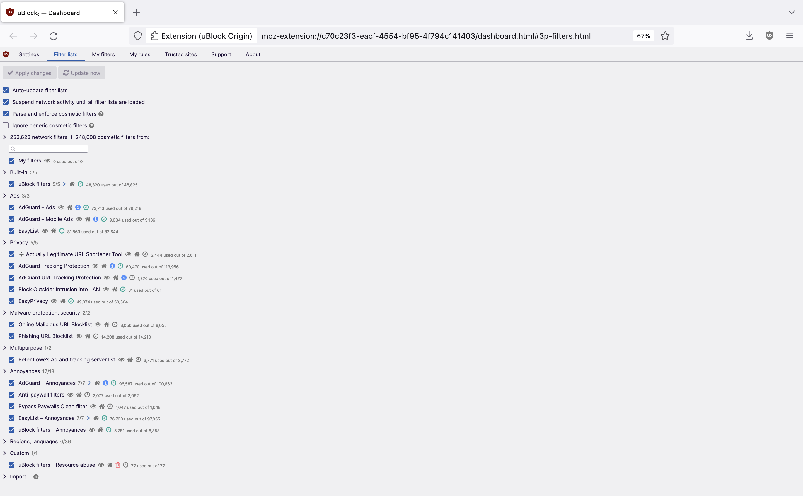
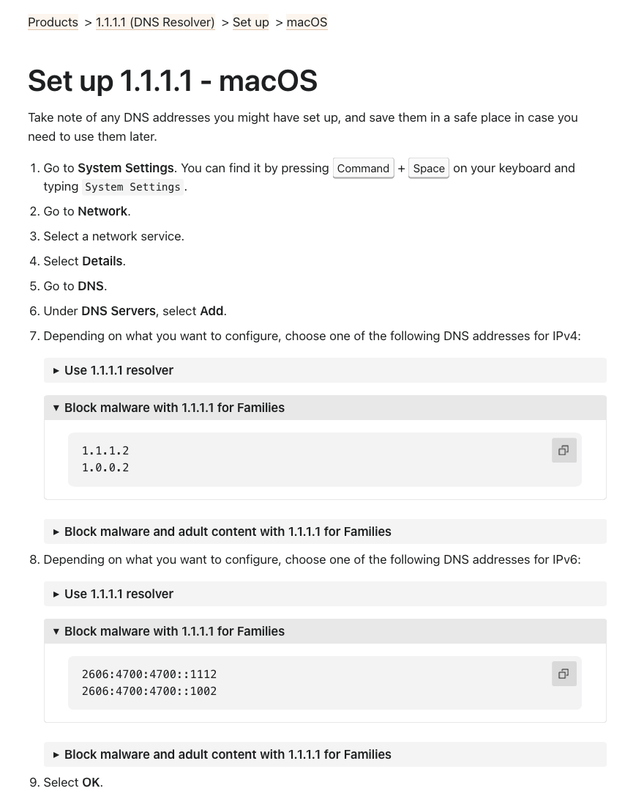

# Useful Links:
- https://dnsleaktest.com
- https://www.speedtest.net/

# Software links:
- http://squidman.net/squidman/
    - IP Binding
- www.airvpn.org
    - VPN w __port forwarding__, split tunneling, kill switch, so works in China
    - Bind to clients and test disconnection for leaks
- https://gpgtools.org/
    - encryption keys
- https://librewolf.net/
    - Librewolf with uBlock Origin 
- https://developers.cloudflare.com/1.1.1.1/setup/
    - Cloudflare DNS resolver instead of ISP's DNS resolver 
- https://www.torproject.org/download/

# Setting up a VPS:
- Mac Terminal syntax: ssh user@publicIP
    - e.g. `ssh root@167.172.252.178`
- Windows: PuTTY
- TEXT MELISSA PASSWORDS TO STOP FORGETTING THEM
- Install java from terminal: `apt install openjdk-19-jre-headless`
- For file stuff
    - Winows: WinSCP
    - Mac: Finder sucks. Cyberduck https://cyberduck.io/download/
    - use SFTP protocol, port 22

# Remote Desktop (xubunutu-desktop) for VPS
- install desktop (xubuntu is faster than ubuntu): `sudo apt install xubuntu-desktop`
- install xrdp: `sudo apt install xrdp --disable-ipv6`
- check xrdp has auto-started: `sudo systemctl status xrdp`
    - to disable (inter-dependent with xrdp-sesman): `sudo systemctl disable xrdp && sudo systemctl disable xrdp xrdp-sesman`
- add a user for remote desktop: `sudo adduser [user name]`
    - list users: `less /etc/passwd`
    - change password: `sudo passwd [user name]`
- Allow RDP port 3389: `sudo ufw allow 3389/tcp`
    - firewall customization: `sudo nano /etc/default/ufw`
    - `sudo ufw disable` and `sudo ufw enable`
- restart xrdp: `service xrdp restart`
- `sudo reboot` takes some time...

__Troublshooting__:
- Stop xrdp `sudo service xrdp stop`
- Replace these lines from the xrdp start script: `sudo nano /etc/xrdp/startwm.sh`
```
test -x /etc/X11/Xsession && exec /etc/X11/Xsession 
exec /bin/sh /etc/X11/Xsession
```
with
```
startxfce4
```
- Restart xrdp with `sudo service xrdp start`


- permission denied errors: `sudo chmod -R 777 <directory_name>`

